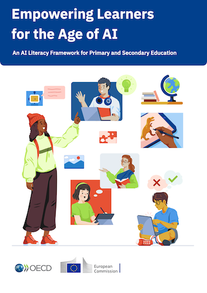

# OECD AI Literacy Framework

Excerpts from _"Empowering learners for the age of AI: An AI literacy framework for primary and secondary education"_, published by the OECD / European Union in 2026 under CC BY 4.0 license.
Link: https://ailiteracyframework.org/

## Chapter 1: Introduction

> AI literacy, as a set of knowledge, skills and attitudes, equips learners to understand how AI systems work, critically evaluate their outputs and use them ethically and creatively.

> AI literacy is different from AI tool use. AI literacy draws from understanding how AI works and critically evaluating the role of AI in daily life. These understandings can lead to more creative, effective, inclusive and ethical use of AI tools; however, simply interacting with AI tools neither develops nor depends on the[se] knowledge, skills or competences ...

## Chapter 2: Foundations of the AILit Framework

Competencies are grouped in four Domains:

> **Engage with AI**, as a foundational domain, sets the basis for learners to think critically about the role of AI in daily life.
> Once learners have a grasp of the foundational competences presented in this domain, they can **Create with AI** and **Manage AI**. These two domains occur in parallel and emphasise hands-on experiences with AI to explore novel ideas and delegate tasks.
> The domains culminate with **Shape AI**, which empowers young people to integrate their understanding of how AI systems work with reflection about how AI systems can be improved for societal benefit.

Each domain collects between 4 and 7 competencies, and each competency has three levels (Basic, Intermediate, Advanced), which are made concrete with _Learner Expectations_ and _Learning Scenarios_ (in-classroom examples).
Each competence is cross-referenced to some of the _Knowledge_ building blocks, relevant _Skills_ and corresponding _Attitudes_ of the learners (all detailed in Chapter 4).

### Opportunities and Risks of AI in Education

> Learners who use AI may indeed complete higher quality work or demonstrate mastery of concepts more quickly than learners who do not use AI; however, these outcomes do not translate into durable learning gains ([OECD, 2026a](https://doi.org/10.1787/062a7394-en)).
> Offloading one’s cognitive efforts to AI may foster “metacognitive laziness,” weakening learners’ critical thinking and self-regulation ([Fan et al., 2025](https://doi.org/10.1111/bjet.13544)).
> Overreliance on AI tools can also leave young people underprepared for assessments where AI use is restricted ([Villar Onrubia et al., 2025](https://data.europa.eu/doi/10.2760/8636621)).

## Chapter 3: Development Process

### Ethics in the Framework

> ... These principles emphasise learner agency; transparency and explainability in how AI systems operate; responsibility to use AI in fair, inclusive and accountable ways; consideration for personal privacy; environmental stewardship; and ongoing inquiry into who benefits from and who might be disadvantaged by AI use.
> 
> Evaluating the ethical and societal implications of AI systems requires learners to understand not only how AI works, but also how design and development choices serve different purposes across contexts. ...

## Chapter 4: The AILit Framework

Starts with a neatly organized collection of 17 _Knowledge_ statements about:

1. **The Nature of AI** (e.g., _1.1 AI is not human_, or _1.5 AI requires significant resources_)
2. **AI Reflects Human Choices and Perspectives** (e.g., _2.1 Building and maintaining AI systems relies on humans_ or _2.2 AI is trained on vast datasets ... includ[ing]copyright-protected materials, synthetic data, unverified information, as well as private and public data obtained in unethical or nonconsensual ways_)
3. **AI’s Capabilities and Limitations**
4. **AI’s Role in Society**

The framework formulates seven fundamental _Skills_:

* **Critical Thinking**: Evaluate AI use and AI-generated content for accuracy, fairness and bias to make informed and ethical decisions.
* **Collaboration**: Guide interactions with AI by communicating clearly, providing feedback and navigating shared tasks.
* **Creativity**: Use AI to build and reflect on original ideas or to explore new ones.
* **Problem Solving**: Determine if, when and how to use AI for a task by assessing its capabilities, risks and ethical implications
* **Computational Thinking**: Decompose problems and provide instructions in ways that allow AI systems to effectively contribute to solutions
* **Communication**: Describe how AI works in a way that promotes transparency, avoids anthropomorphism and encourages responsible use.
* **Self and Social Awareness**: Recognise how AI influences personal choices, relationships and communities and reflect on its broader societal and environmental impacts.

Finally, the framework highlights six _Attitudes_ that may constitute the learner's mindset (to varying degrees in different situations):

* **Reflective**: _"question the assumptions and narratives surrounding AI ..._"
* **Responsible**: _"think carefully about how they use AI and recognise that they are accountable for their choices ..._"
* **Curious**: _"eager to explore what AI can and cannot do today and how it might evolve in the future ..."_
* **Innovative**: _"address real-world challenges and embrace new opportunities ..."_
* **Adaptable**: _"perseverance and flexibility when working with AI ..."_
* **Empathetic**: _"thoughtfully examine how AI impacts individuals, communities and the environment ..."_

### Domain: Engage with AI

1. Recognise AI’s role and influence in different contexts.
2. Describe how AI systems perform tasks using language that addresses and clarifies common misconceptions.
3. Evaluate whether AI outputs should be accepted, revised or rejected.
4. Examine how predictive AI systems provide recommendations that can inform or limit perspectives.
5. Compare how AI systems consume energy and natural resources.
6. Explain how AI could be used to amplify societal biases.
7. Analyse how well the use of an AI system aligns with ethical principles and human values.

Example for Competence 2:

| Basic | Intermediate | Advanced |
|-------|--------------|----------|
| _Learners know AI is a non-human tool that produces outputs based on patterns of data and lacks authentic context or understanding._ | _Learners accurately describe how a specific AI tool carries out a task in order to address commonly-held misconceptions about how AI works._ | _Learners explain how different AI systems work using language that does not attribute human traits or abilities, knowing that their phrasing shapes understanding._ |
| In the Classroom: _Teacher introduces common phrases used to describe AI use (e.g. “AI thinks,” “AI understands,”), learners identify which ones are misleading and why. ..._ | In the Classroom: _Learners identify a common AI myth among peers (e.g. “AI understands like humans” or “AI is always correct”). They create an artefact, such as a poster, short video or podcast to address the misconception by explaining how AI works._ | In the Classroom: _Learners review different types of AI tools and compare design choices that make the systems appear human-like, friendly or intelligent. ... practise explaining how the tools produce outputs, focussing on programmed processes rather than human qualities ..._ |

### Domain: Create with AI

1. Use AI systems to explore new perspectives and approaches that build upon original ideas.
2. Visualise, prototype and combine ideas using different types of AI systems.
3. Direct generative AI systems to elicit feedback, refine results and support reflection.
4. Analyse how AI can safeguard or violate content authenticity and intellectual property.

### Domain: Manage AI

1. Decide whether to use AI systems based on the nature of the task.
2. Choose an appropriate AI approach for a task by comparing how different AI systems operate and what they are best suited to do.
3. Decompose a problem to determine when and how AI systems should be used to automate or augment tasks.
4. Monitor and evaluate AI use throughout a problem-solving process.

### Domain: Shape AI

1. Investigate how an AI system is intended to work, whom it is designed for and what its limitations are.
2. Evaluate AI systems using defined criteria, expected outcomes, test cases and user feedback.
3. Design AI systems with attention to how data sources, selection and information flow influence behaviour and outputs.
4. Improve AI systems to address and promote human well-being and societal benefit.
