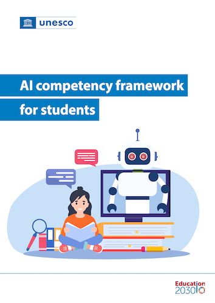

# UNESCO AI competency framework for students

## Chapter 1: Introduction

### 1.1 Why an AI competency framework for students?

> Education, as a public sector, cannot be reduced to a testing ground for the passive adoption of AI.

> Far too often, the definition of AI competencies for students is influenced by training designed and/or provided by private companies, which tends to focus on technical skills to operate profit-driven AI platforms.

## Chapter 2: Key Principles

### 2.1 Fostering a critical approach to AI

> Critical thinking is a fundamental skill that students need to meaningfully engage with AI as learners, users and creators. Students also have the responsibility to determine what types of AI should be developed and how they should be used to drive human societies towards inclusive, environmentally sound, shared futures.

> ... foster a critical approach to AI by engaging students with fundamental questions, such as: is AI poised to help solve real-world challenges faced by humans, or does it pose insurmountable threats to humans? Are adverse impacts on climate of training and using AI disproportionate to its anticipated benefits? What social, economic, political and demographic impacts of the use of AI should be carefully reviewed?

> ... profound implications for human agency, human interactions, social equity, economic inclusiveness, and environmental sustainability.

> The pre-condition for responsible use consists in students’ abilities to detect the trustworthiness and proportionality of AI tools.

> This includes examining and understanding its impact on human agency, social inclusion and equity, institutional and individual security, cultural and linguistic diversity, the construction and expression of plural opinions, as well as on the environment and on ecosystems.
> Students are expected to move beyond the misconception that AI is a solution to everything. Rather, they are to become conscious decision-makers on when AI systems and applications should, or should not, be used; what problems they may or may not solve; and when and how AI should be designed and used as one part of a wider solution.

### 2.2 Prioritizing human-centred interaction with AI

> ... a key danger is its potential to undermine human agency and compromise the development of human intellectual skills.

> ... the framework aims to prevent students from becoming addicted to or dependent on AI, and to foster behaviours that maintain human accountability for high-stakes decisions.
