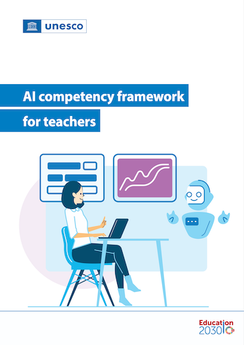

# UNESCO AI competency framework for students

Excerpts from the _"AI competency framework for teachers"_, published by the UNESCO in 2024 under CC BY-SA 3.0 IGO license.
Link: https://unesdoc.unesco.org/ark:/48223/pf0000391104

## Chapter 1: Introduction

### 1.1 Why an AI competency framework?

> ... AI can pose significant risks to students, the teaching community, education systems and society at large.
> AI may threaten human agency, intensify climate change, violate data privacy, deepen long-standing systemic inequalities and exclusion, and lead to new forms of discrimination.
> In education, AI can reduce teaching and learning processes to calculations and automated tasks in ways that devalue the role and influence of teachers and weaken their relationships with learners.
> It can narrow education to only that which AI can process, model and deliver.
> Finally, it can also exacerbate the worldwide shortage of qualified teachers through disproportionate spending on technology at the expense of investment in human capacity development.
> The use of AI in education therefore requires careful consideration ...

### 1.4 Technological advances in AI and implications for teacher competencies

> ... risk that over-reliance on AI could lead to the atrophy of teachers’ essential competencies.
> This potential of AI to usurp the autonomous decision-making capacity of teachers necessitates a stronger emphasis on teacher agency and on a human-centred mindset ...

> ... design of AI platforms involves actively preying on and exploiting personal data, often without consent
> ... aggressive approach to the design and provision of AI services 
> ... heightens the urgency of empowering teachers to understand the ethical issues related to interacting with various AI tools in their teaching, in order to ensure safe and responsible use among students.

> ... stochastic in generating outputs or predictions, as the same inputs may lead to different outputs.
> The AI-generated content is thus potentially less trustworthy, especially for the teaching of factual and conceptual knowledge.
> Given the opaqueness of the ‘black box’ behind the methods used in AI, teachers need both an understanding of
how AI is trained and how AI works.

> ... it is important to guide teachers to understand its social impact and the responsibilities of citizenship in emerging AI societies, and to motivate and support them through continuous professional learning.

## Chapter 2: Key principles

The framework has six key principles: 

1. Ensuring inclusive digital futures
2. A human-centred approach to AI
3. Protecting teachers’ rights and iteratively (re)defining teachers’ roles
4. Promoting trustworthy and environmentally sustainable AI for education
5. Ensuring applicability for all teachers and reflecting digital evolution
6. Lifelong professional learning for teachers

### 2.1 Ensuring inclusive digital futures

Interesting perspective: _"Teachers are the primary users of AI in education"_, i.e., **not** the students.

> ... four main tenets:
> 
> * Debunking AI hype: ...
>
> * Understanding threats inherent to the design of AI: ...
>
> * Ensuring human and social values prevail: ...
>
> * Steering AI for human capacity development: ...

## Chapter 3: Structure of the AI competency framework for teachers

Matrix with two dimensions:

- Five aspects of AI competency: a human-centred mindset, ethics of AI, AI foundations and applications, AI pedagogy, and AI for professional development
- Three levels of progression:

> ‘Acquire’, which defines the essential set of AI competencies all teachers need in order to evaluate, select and use AI tools appropriately in education;
> ‘Deepen’, which specifies intermediate competencies that are needed to design meaningful pedagogical strategies that integrate AI;
> and ‘Create’, which sets out advanced competencies required for the creative configuration of AI systems and innovative use of AI in education.

Note: "Innovative use of AI in education" only comes on level 3.

### 3.2 Aspects of the AI CFT

> Teachers are expected to gain appropriate understanding of the definition of AI, basic knowledge about how AI works, as well as about the main categories of AI technologies; the skills necessary to evaluate appropriateness and limitations of AI tools based on specific needs in specific domains and contexts; ...

> ... teachers need to develop the ability to critically assess when and how to use AI in teaching and learning in an ethical and human-centred manner ...

Important:

> These five aspects are intertwined and complementary, not isolated. In general, effective teaching (with or without AI) requires a holistic approach that integrates various competencies.

In other words, teachers cannot _only_ focus on "AI pedagogy".

### 3.3 Progression levels of the AI CFT

For level 1 'Acquire':

> Supported by appropriate training and guidance, all teachers are expected to be able to:
>
> 1. Cultivate a critical understanding that AI is human-led and that the corporate and individual decisions of
AI creators have a profound impact on human autonomy and rights. ...
> 2. Develop a basic understanding of typical ethical issues related to AI and to human–AI interactions as they relate to the protection of human rights, personal data, human agency, and linguistic and cultural diversity, and advocate for inclusion and environmental sustainability.
> 3. Acquire basic knowledge about what AI technology is and how AI models are trained, associated knowledge on data and algorithms, the main categories of AI technologies and examples of each ...

For level 2 'Deepen':

> Teachers ... at this level are expected to be able to:
> 
> 1. Demonstrate a deepened understanding of human accountability and human determination in the proper deployment and use of AI. This implies a critical mindset of AI’s capacity to facilitate human–AI decision loops, as well as of overhyped claims on the use of AI to substitute humans in making high-stakes decisions in education.
> 2. Internalize essential ethical rules for the safe and responsible use of AI including respecting data privacy, intellectual property rights, as well as other legal provisions, and adopt this ethical perspective when assessing and using AI tools, data and AI-generated content in education.

## Chapter 4: The AI CFT specifications

The framework details specific _teacher competencies_ for each of the five aspects at each of the three levels, along with multiple _curricular goals_, CGs, (i.e., _"Teacher training or support programmes should ..."_), _learning objectives_, LOs, (i.e., _"Teachers can ..."_), and _contextual activities_ (i.e., for teachers to demonstrate attitudes and behaviors).

This is a summary of the learning outcomes:

| **Aspect** | **1. Acquire** | **2. Deepen** | **3. Create** |
|---------|---------------|----------|-----------|
| Human-centred mindset | 1. Reflect on benefits, limitations and risks of AI tools 2. Corporate decisions affect human rights, human agency, individual lives and societies 3. Role of humans in data collection and processing, design of algorithms and features, deployment and use of AI tools 4. Basic protection measures | ... | ... |
| Ethics of AI | ... | ... | ... |
| AI foundations and applications | ... | ... | ... |
| AI pedagogy | ... | ... | ... |
| AI for professional development | ... | ... | ... |

## Chapter 5: Suggested implementation strategies

### 5.2 Build enabling policies and conditions for the use of AI in education

Policy function no. 1:

> ... One of the primary functions of policies on AI in education is to help institutions to weigh the option of AI against other existing options and priorities, before promoting its use to teachers.

> ... trade-offs between the forward-looking yet unproven value of AI for education, versus the urgent need to ensure/improve other conditions for learners, independent of technology. It is fair to argue that, despite media hype, AI is unlikely to solve any of the major problems confronting education systems around the world, such as inadequate school infrastructure or teacher shortages.

> ... decisions must be informed by rigorous evidence-based research and multistakeholder dialogue. 

> ... teachers should be able to choose to apply affordable AI tools or co-create relevant solutions only after determining that benefits clearly outweigh the risks.

Policy function no. 2:

> A second function of policies on AI in education is to support and motivate teachers to use AI in a responsible manner.
> Strategies to motivate teachers could include such actions as: ... introducing measures to mitigate the negative impact of AI use on teachers’ workloads and well-being; providing well-funded relevant training on AI and school-based support programmes grounded in needs assessments; ...

Policy function no. 3:

> The third function of policy frameworks can be to support teachers to address the barrier of AI access and affordability.